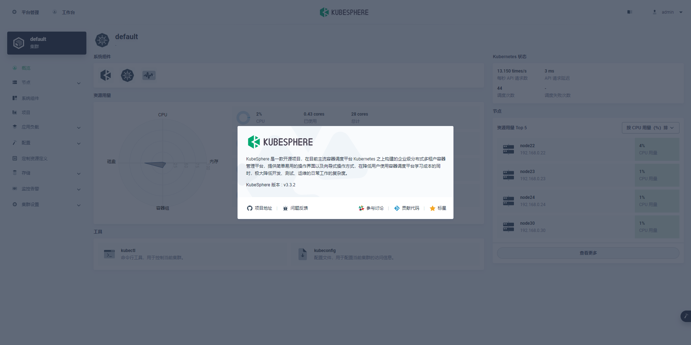

## Overview

KubeSphere is a distributed operating system for cloud-native application management, using Kubernetes as its kernel. It provides a plug-and-play architecture, allowing third-party applications to be seamlessly integrated into its ecosystem.

## Prepare a cluster

```
sealos run \
  docker.io/labring/kubernetes:v1.24.10 \
  docker.io/labring/helm:v3.11.0 \
  docker.io/labring/calico:v3.24.5 \
  docker.io/labring/openebs:v3.4.0 \
  --masters 192.168.0.22 \
  --nodes 192.168.0.23,192.168.0.24,192.168.0.30 \
  -p 123456
```

## Install kubesphere

Prerequisites: You should check the official document of kubesphere to confirm which versions of kubernetes are compatible with kubesphere.

```shell
sealos run docker.io/labring/kubesphere:v3.3.2
```
or
```
sealos run registry.cn-hongkong.aliyuncs.com/labring/kubesphere:v3.3.2 
```

Check pods status

```shell
root@node22:~# kubectl get pods -A
NAMESPACE                      NAME                                               READY   STATUS    RESTARTS   AGE
calico-apiserver               calico-apiserver-8459b746b5-9wng4                  1/1     Running   0          13h
calico-apiserver               calico-apiserver-8459b746b5-wbrpn                  1/1     Running   0          13h
calico-system                  calico-kube-controllers-7cd8b89887-dcx5k           1/1     Running   0          13h
calico-system                  calico-node-6lcmm                                  1/1     Running   0          13h
calico-system                  calico-node-7vgdt                                  1/1     Running   0          13h
calico-system                  calico-node-gkhxh                                  1/1     Running   0          13h
calico-system                  calico-node-r72zq                                  1/1     Running   0          13h
calico-system                  calico-typha-74d4686685-mhqw6                      1/1     Running   0          13h
calico-system                  calico-typha-74d4686685-rf52b                      1/1     Running   0          13h
calico-system                  csi-node-driver-4q4sg                              2/2     Running   0          13h
calico-system                  csi-node-driver-cw2kh                              2/2     Running   0          13h
calico-system                  csi-node-driver-dn44z                              2/2     Running   0          13h
calico-system                  csi-node-driver-pjzqf                              2/2     Running   0          13h
kube-system                    coredns-57575c5f89-7rzzb                           1/1     Running   0          13h
kube-system                    coredns-57575c5f89-lk7fd                           1/1     Running   0          13h
kube-system                    etcd-node22                                        1/1     Running   0          13h
kube-system                    kube-apiserver-node22                              1/1     Running   0          13h
kube-system                    kube-controller-manager-node22                     1/1     Running   0          13h
kube-system                    kube-proxy-6966k                                   1/1     Running   0          13h
kube-system                    kube-proxy-84mr5                                   1/1     Running   0          13h
kube-system                    kube-proxy-mt6xw                                   1/1     Running   0          13h
kube-system                    kube-proxy-v84rw                                   1/1     Running   0          13h
kube-system                    kube-scheduler-node22                              1/1     Running   0          13h
kube-system                    kube-sealos-lvscare-node23                         1/1     Running   0          13h
kube-system                    kube-sealos-lvscare-node24                         1/1     Running   0          13h
kube-system                    kube-sealos-lvscare-node30                         1/1     Running   0          13h
kube-system                    snapshot-controller-0                              1/1     Running   0          11h
kubesphere-controls-system     default-http-backend-69478ff5f9-zjrcl              1/1     Running   0          11h
kubesphere-controls-system     kubectl-admin-568b698d7-25kvh                      1/1     Running   0          11h
kubesphere-monitoring-system   alertmanager-main-0                                2/2     Running   0          11h
kubesphere-monitoring-system   alertmanager-main-1                                2/2     Running   0          11h
kubesphere-monitoring-system   alertmanager-main-2                                2/2     Running   0          11h
kubesphere-monitoring-system   kube-state-metrics-6f6ffbf895-dwh2r                3/3     Running   0          11h
kubesphere-monitoring-system   node-exporter-27cdd                                2/2     Running   0          11h
kubesphere-monitoring-system   node-exporter-72c5v                                2/2     Running   0          11h
kubesphere-monitoring-system   node-exporter-d4hxn                                2/2     Running   0          11h
kubesphere-monitoring-system   node-exporter-fbf6p                                2/2     Running   0          11h
kubesphere-monitoring-system   notification-manager-deployment-77d5b49896-knsh4   2/2     Running   0          11h
kubesphere-monitoring-system   notification-manager-deployment-77d5b49896-xfw4z   2/2     Running   0          11h
kubesphere-monitoring-system   notification-manager-operator-66c6967d78-j5gwb     2/2     Running   0          11h
kubesphere-monitoring-system   prometheus-k8s-0                                   2/2     Running   0          11h
kubesphere-monitoring-system   prometheus-k8s-1                                   2/2     Running   0          11h
kubesphere-monitoring-system   prometheus-operator-b56bb98c4-bgp2p                2/2     Running   0          11h
kubesphere-system              ks-apiserver-676cf6f6ff-rxzdb                      1/1     Running   0          11h
kubesphere-system              ks-console-68f9d9d945-7wr65                        1/1     Running   0          11h
kubesphere-system              ks-controller-manager-6cc9d49fcd-vw6wh             1/1     Running   0          11h
kubesphere-system              ks-installer-97b474f7c-pzjqw                       1/1     Running   0          11h
openebs                        openebs-localpv-provisioner-779c8dcc57-vt4kt       1/1     Running   0          13h
tigera-operator                tigera-operator-775db57c57-zcgph                   1/1     Running   0          13h
```

## Login kubesphere UI

Default username/password is `admin/P@88w0rd`

```
http://192.168.0.22:30880
```

web console


